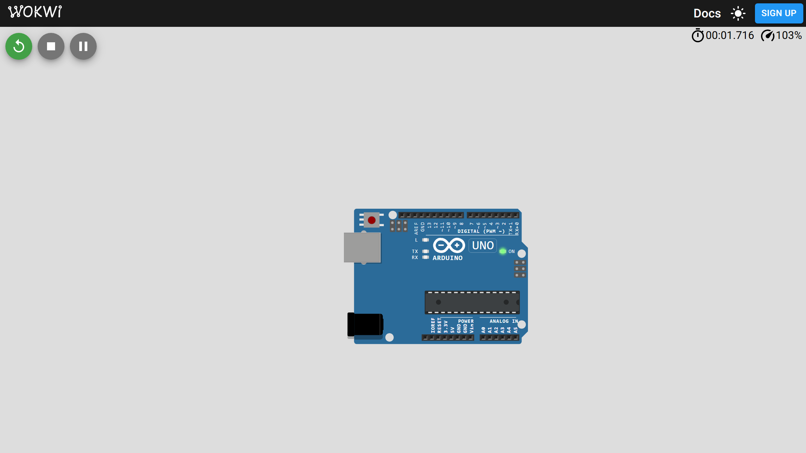
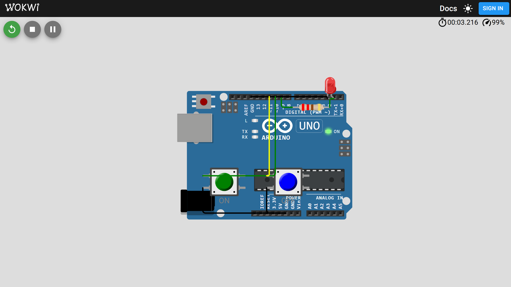
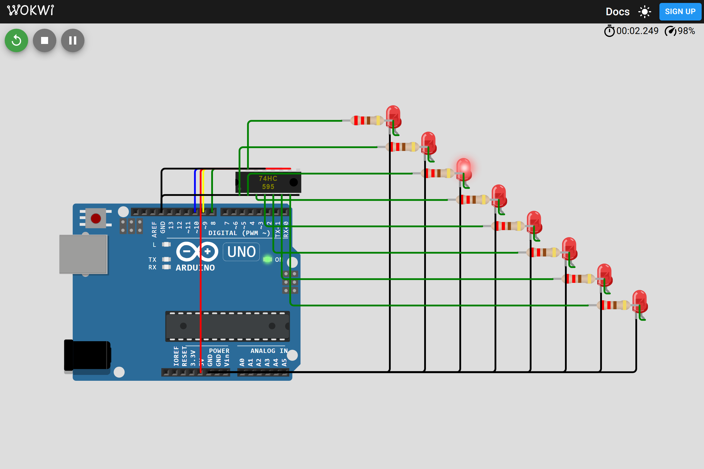

# Embedded Hub

Monorepo for embedded firmware projects: Arduino Uno today, ESP32 and robotics later.

## Workflow

1. Edit source in **Cursor** (or any editor).
2. Open the project sketch folder in **Arduino IDE** (`File → Open`).
3. Select board and serial port, then **Upload**.

## Project layout

All firmware lives under `projects/`. Each project uses this naming pattern:

```
projects/NN-kebab-name/
```

- `NN` — two-digit ordinal (`00`, `01`, `02`, …)
- `kebab-name` — short descriptive slug

Every project should contain:

- `NN-name.ino` — main sketch (folder name must match `.ino` filename for Arduino IDE)
- `README.md` — quick start and upload instructions
- `docs/` — detailed documentation in Markdown

See [`.cursor/README.md`](.cursor/README.md) for AI agent rules and skills used in this repo.

## Circuit diagrams and simulation

| Tool | Guide | Role in this repo |
|------|-------|-------------------|
| **Wokwi** | [WOKWI.md](WOKWI.md) | Primary — `diagram.json` + simulation in Cursor |
| **Fritzing** | [FRITZING.md](FRITZING.md) | Optional — breadboard/PCB diagrams (`.fzz`) |

## Projects

| Preview | # | Name | Board | Description |
|---------|---|------|-------|-------------|
|  | 00 | [00-blink](projects/00-blink/) | Arduino Uno | Built-in LED blink — first template project |
|  | 01 | [01-led-buttons](projects/01-led-buttons/) | Arduino Uno | External LED blink or two-button on/off control |
|  | 02 | [02-rgb-led](projects/02-rgb-led/) | Arduino Uno | RGB LED color mixing with PWM |
|  | 03 | [03-buzzer](projects/03-buzzer/) | Arduino Uno | Active or passive buzzer beeps and tone scale |
|  | 04 | [04-shift-register](projects/04-shift-register/) | Arduino Uno | 74HC595 LED chase, 7-segment, or light bar |

Preview images are generated locally — use the **`wokwi-preview`** skill or `npm run capture-preview:all` (see [WOKWI.md](WOKWI.md)).

## Optional per-project folders

Add these when a project needs them:

| Path | Purpose |
|------|---------|
| `diagram.json`, `wokwi.toml` | Wokwi circuit + simulation ([WOKWI.md](WOKWI.md)) |
| `schematics/preview.png` | Wokwi simulation teaser (generate with `wokwi-preview` skill) |
| `lib/` | Vendored Arduino libraries |
| `photos/` | Build and breadboard photos |
| `docs/troubleshooting.md` | Upload/runtime issue notes |
| `docs/changelog.md` | Firmware version history |
