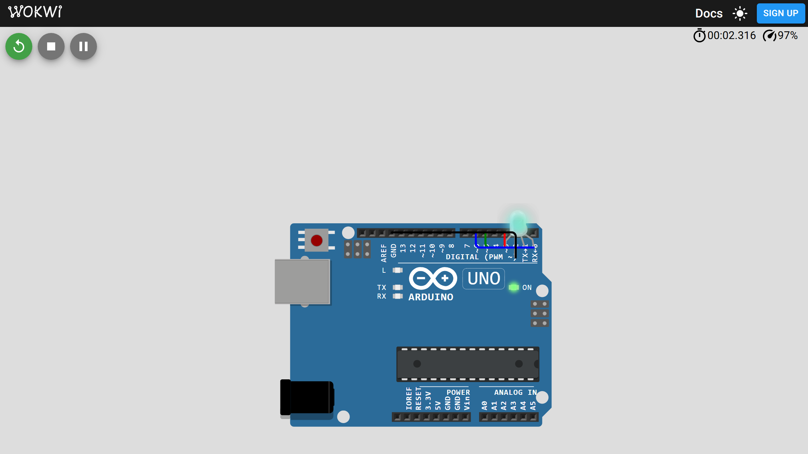

# 02-rgb-led — RGB LED Color Mixing

**Board:** Arduino Uno  
**PWM-driven RGB LED with random color channel updates.**



## Goal

Learn `analogWrite()` PWM on three pins to mix red, green, and blue on a common-cathode RGB LED.

## Quick start (Arduino IDE)

1. Open `projects/02-rgb-led/` in Arduino IDE (`File → Open`).
2. Select board: **Arduino Uno**.
3. Select port: your USB serial port (e.g. `COM3` on Windows).
4. Wire the RGB LED per [docs/wiring.md](docs/wiring.md).
5. Click **Upload**.

## Expected behavior

The LED starts white (all channels at 255). Every second, one channel (red, then green, then blue) is set to a new random value while the others keep their current levels. Colors cycle continuously.

## Simulation (Wokwi)

This project includes `diagram.json` and `wokwi.toml` for [Wokwi](https://wokwi.com/) simulation. See [WOKWI.md](../../WOKWI.md).

1. Install the **Wokwi for VS Code** extension.
2. Compile firmware into `build/`:

   ```bash
   cd projects/02-rgb-led
   arduino-cli compile --fqbn arduino:avr:uno --output-dir build 02-rgb-led.ino
   ```

3. Run **Wokwi: Start Simulator** (`F1`).

Regenerate the preview with the `wokwi-preview` skill (see [WOKWI.md](../../WOKWI.md)).

## Documentation

- [Overview](docs/overview.md)
- [Hardware](docs/hardware.md)
- [Wiring](docs/wiring.md)
