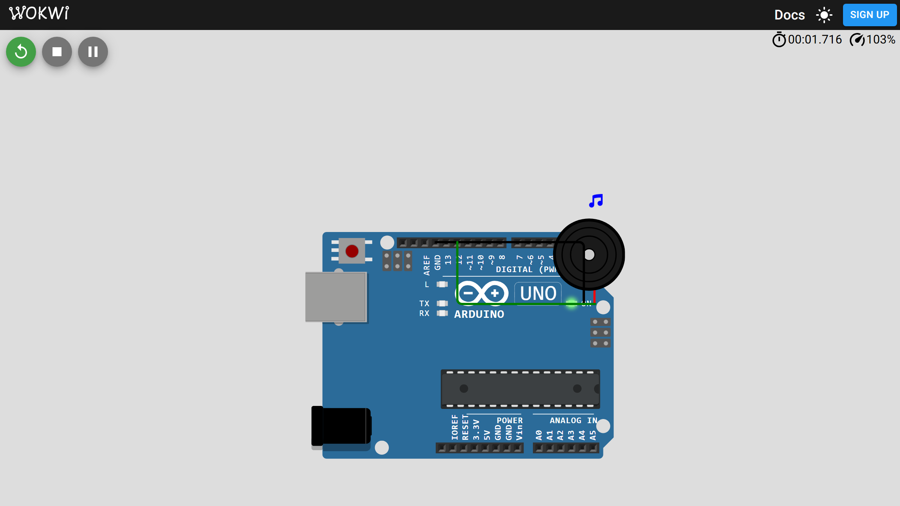

# 03-buzzer — Active and Passive Buzzer

**Board:** Arduino Uno  
**Digital beeps or PWM tone scale on a buzzer module.**



## Goal

Compare active buzzers (fixed tone when powered) with passive buzzers (frequency controlled via `tone()`).

## Quick start (Arduino IDE)

1. Open `projects/03-buzzer/` in Arduino IDE (`File → Open`).
2. Select board: **Arduino Uno**.
3. Select port: your USB serial port (e.g. `COM3` on Windows).
4. Set `BUZZER` in `03-buzzer.ino` to `Active` or `Passive` to match your hardware (default: `Passive`).
5. Connect the buzzer module to pin 12 per [docs/wiring.md](docs/wiring.md).
6. Click **Upload**.

## Expected behavior

**Passive (default):** Plays an ascending C-major scale (Do–Do) using `tone()`, then pauses briefly and repeats.

**Active:** Five short beeps (50 ms on, 50 ms off), then 5 s silence, then repeats.

## Simulation (Wokwi)

This project includes `diagram.json` and `wokwi.toml` for [Wokwi](https://wokwi.com/) simulation. See [WOKWI.md](../../WOKWI.md).

1. Install the **Wokwi for VS Code** extension.
2. Compile firmware into `build/`:

   ```bash
   cd projects/03-buzzer
   arduino-cli compile --fqbn arduino:avr:uno --output-dir build 03-buzzer.ino
   ```

3. Run **Wokwi: Start Simulator** (`F1`).

The Wokwi buzzer part behaves like a passive buzzer; use `Passive` mode for simulation. Regenerate the preview with the `wokwi-preview` skill (see [WOKWI.md](../../WOKWI.md)).

## Documentation

- [Overview](docs/overview.md)
- [Hardware](docs/hardware.md)
- [Wiring](docs/wiring.md)
